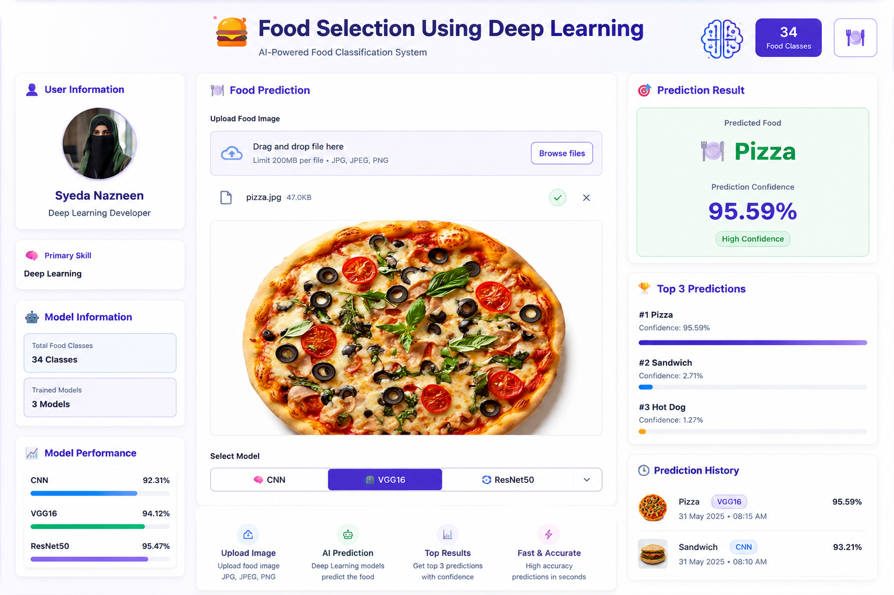

# 🍔 Food Selection Using Deep Learning

<p align="center">
  
</p>

<p align="center">
  <b>An AI-Powered Food Classification System using Deep Learning and Transfer Learning</b>
</p>

<p align="center">
  <a href="https://foodselectionusingdeeplearning-16.streamlit.app/">
    🚀 Live Demo
  </a>
  &nbsp; | &nbsp;
  <a href="https://github.com/SyedaNazneen/Food_Selection_Using_Deep_Learning">
    💻 GitHub Repository
  </a>
</p>

---

## 🚀 Live Application

Experience the deployed application here:

👉 **Live Demo:**  
https://foodselectionusingdeeplearning-16.streamlit.app/

The application allows users to upload a food image and classify it using Deep Learning models.

---

# 📌 Project Overview

Food image classification is a **Computer Vision and Deep Learning problem** where an AI model analyzes an uploaded food image and predicts its food category.

This project implements and compares **three Deep Learning architectures**:

- 🧠 Custom CNN
- 🧠 VGG16
- 🧠 ResNet50

The application provides:

- Predicted Food Category
- Prediction Confidence
- Top 3 Predictions
- Model Accuracy Comparison
- Best Performing Model Information

---

# 🧠 Deep Learning Models

## 1️⃣ Custom CNN

A Convolutional Neural Network built from scratch for food image classification.

### Features

- Convolution Layers
- Max Pooling
- Batch Normalization
- Dropout
- Fully Connected Layers

### Validation Accuracy

**64.35%**

---

## 2️⃣ VGG16

VGG16 is a popular Transfer Learning architecture that uses pre-trained convolutional layers for feature extraction.

### Features

- Pre-trained ImageNet Weights
- Transfer Learning
- Fine-Tuning
- Deep Feature Extraction

### Validation Accuracy

**75.12%**

---

## 3️⃣ ResNet50

ResNet50 is a powerful Deep Residual Neural Network that uses skip connections to improve training performance.

### Features

- Residual Connections
- Deep Feature Extraction
- Transfer Learning
- Fine-Tuning

### Validation Accuracy

🏆 **82.94%**

### 🥇 Best Performing Model

**ResNet50**

---

# 📊 Model Performance Comparison

| Model | Validation Accuracy |
|------|--------------------|
| Custom CNN | 64.35% |
| VGG16 | 75.12% |
| 🏆 ResNet50 | **82.94%** |

```text
Custom CNN  → 64.35%
VGG16       → 75.12%
ResNet50    → 82.94%
